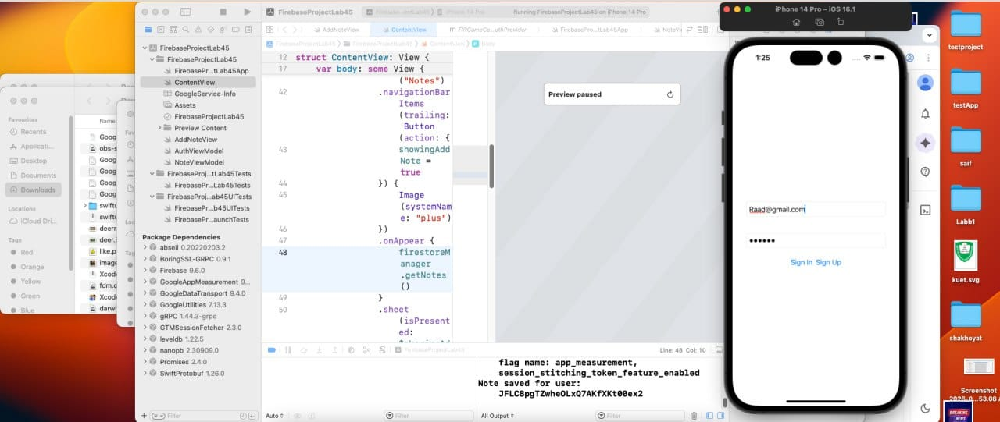
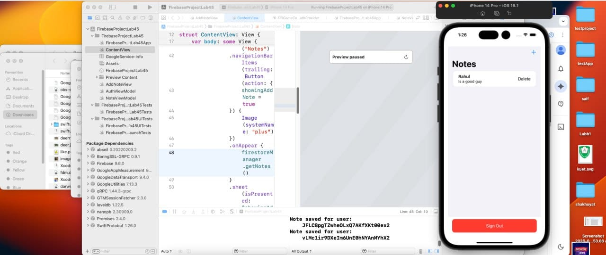

# FirebaseProjectLab45

A SwiftUI notes app integrated with Firebase Authentication and Cloud Firestore.

## Project Overview

This app lets users:
- Sign up and sign in with email/password
- Add notes
- Edit notes
- Delete notes
- See only their own notes (filtered by Firebase Auth user ID)
- Sign out

## Tech Stack

- SwiftUI
- Firebase iOS SDK (Swift Package Manager)
  - FirebaseAuth
  - FirebaseFirestore
  - FirebaseFirestoreSwift
  - FirebaseAnalytics
  - FirebaseAnalyticsSwift

## Folder Structure

```text
FirebaseProjectLab45/
├── FirebaseProjectLab45/
│   ├── FirebaseProjectLab45App.swift
│   ├── ContentView.swift
│   ├── AuthViewModel.swift
│   ├── NoteViewModel.swift
│   ├── AddNoteView.swift
│   └── GoogleService-Info.plist
├── FirebaseProjectLab45.xcodeproj/
├── FirebaseProjectLab45Tests/
├── FirebaseProjectLab45UITests/
├── screenshot1.jpeg
├── screenshot2.jpeg
├── screenshot3.jpeg
└── screenshot4.jpeg
```

## Setup Instructions

1. Open `FirebaseProjectLab45.xcodeproj` in Xcode.
2. Make sure Swift Package dependencies resolve (Firebase iOS SDK).
3. Ensure `GoogleService-Info.plist` exists inside the app target folder (`FirebaseProjectLab45/`).
4. Build and run on iOS Simulator or a real device.

## Firebase Configuration and Packages (from project)

- Firebase is configured in app startup.
- Firebase Swift package is pinned to `firebase-ios-sdk` version `9.6.0` in the project.

## Screenshots

### Screenshot 1


### Screenshot 2


### Screenshot 3


### Screenshot 4


## Code Snippets (copied from your actual files)

### 1) Firebase initialization (`FirebaseProjectLab45/FirebaseProjectLab45App.swift`)

```swift
import SwiftUI
import Firebase

@main
struct FirebaseProjectLab45App: App {
    
    @StateObject private var viewModel = AuthViewModel()

    @State private var email = ""
    @State private var password = ""

    init()
    {
        FirebaseApp.configure()
        print("Configured Firebase!!!")
        
    }
```

### 2) Authentication methods (`FirebaseProjectLab45/AuthViewModel.swift`)

```swift
func signUp(email: String, password: String) {
    Auth.auth().createUser(withEmail: email, password: password) { result, error in
        if let error = error {
            print("Sign Up Error: \(error.localizedDescription)")
            return
        }
        self.user = result?.user
        self.isSignedIn = true
    }
}

func signIn(email: String, password: String) {
    Auth.auth().signIn(withEmail: email, password: password) { result, error in
        if let error = error {
            print("Sign In Error: \(error.localizedDescription)")
            return
        }
        self.user = result?.user
        self.isSignedIn = true
    }
}

func signOut() {
    do {
        try Auth.auth().signOut()
        self.user = nil
        self.isSignedIn = false
    } catch {
        print("Sign Out Error: \(error.localizedDescription)")
    }
}
```

### 3) Firestore model and filtering by current user (`FirebaseProjectLab45/NoteViewModel.swift`)

```swift
struct Note: Identifiable, Codable {
    @DocumentID var id: String?
    var title: String
    var content: String
    var userId: String
}

private var currentUserID: String? {
    return Auth.auth().currentUser?.uid
}

func getNotes() {
    guard let uid = currentUserID else { return }
    
    db.collection("notes")
        .whereField("userId", isEqualTo: uid)
        .addSnapshotListener { snapshot, error in
            if let error = error {
                print("Error getting notes: \(error)")
                return
            }
            
            self.notes = snapshot?.documents.compactMap { document in
                try? document.data(as: Note.self)
            } ?? []
        }
}
```

### 4) Add / Update note logic (`FirebaseProjectLab45/AddNoteView.swift`)

```swift
Button(noteToEdit == nil ? "Save" : "Update Note") {
    if !title.isEmpty {
        if let existingNote = noteToEdit {
            firestoreManager.updateNote(note: existingNote, newTitle: title, newContent: content)
        } else {
            firestoreManager.addNote(title: title, content: content)
        }
        presentationMode.wrappedValue.dismiss()
    }
}
```

### 5) Notes list + delete + edit swipe (`FirebaseProjectLab45/ContentView.swift`)

```swift
List {
    ForEach(firestoreManager.notes) { note in
        HStack {
            VStack(alignment: .leading) {
                Text(note.title).font(.headline)
                Text(note.content).font(.subheadline)
            }
            Spacer()
            Button("Delete") {
                firestoreManager.deleteNote(note: note)
            }
            .buttonStyle(BorderlessButtonStyle())
            .foregroundColor(.red)
        }
        .swipeActions(edge: .leading) {
            Button("Edit") {
                selectedNote = note
                showingSheet = true
            }
            .tint(.blue)
        }
    }
}
```

